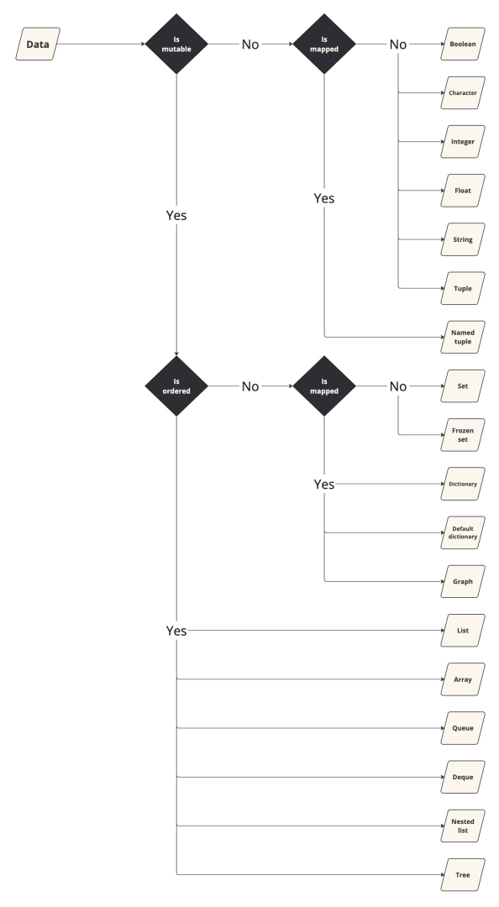

# Python best practices
This page offers a comprehensive list of Python programming best practices. It covers conventional coding principles, object-oriented and functional programming, data structures, and others. It provides guidelines, recommendations, and links to code examples to assist in crafting efficient, maintainable, scalable, and clean Python code. 

## General
1. **DRY Principle (Don’t Repeat Yourself)**:
    - Avoid creating similar scripts or functions.
    - Define variables only once.
2. **KISS Principle (Keep It Simple and Stupid)**:
    - Simplify solutions and understand the limits of simplicity.
    - Complex problems may require complex solutions.
3. **Correct Broken Code Immediately** to prevent future application failures.
4. [**Use the Right Comparator**](https://github.com/Oussama-KIASSI/Data-science-best-practices/blob/a7fb439062930c6f8c2ee4b0fb56468a89d8c8c3/python.py#L1-L27).
5. [**Use Conditional Expressions for simple cases**](https://github.com/Oussama-KIASSI/Data-science-best-practices/blob/a7fb439062930c6f8c2ee4b0fb56468a89d8c8c3/python.py#L30-L35).
6. [**Annotate Python Code with Type Hints**](https://github.com/Oussama-KIASSI/Data-science-best-practices/blob/a7fb439062930c6f8c2ee4b0fb56468a89d8c8c3/python.py#L38-L43).
7. [**Avoid Using**](https://github.com/Oussama-KIASSI/Data-science-best-practices/blob/a7fb439062930c6f8c2ee4b0fb56468a89d8c8c3/python.py#L46-L58) `+` [**and**](https://github.com/Oussama-KIASSI/Data-science-best-practices/blob/a7fb439062930c6f8c2ee4b0fb56468a89d8c8c3/python.py#L46-L58) `+=` [**Operators for String Accumulation**](https://github.com/Oussama-KIASSI/Data-science-best-practices/blob/a7fb439062930c6f8c2ee4b0fb56468a89d8c8c3/python.py#L46-L58) (as they may lead to quadratic running time).
8. [**Avoid Mutable Global State**](https://github.com/Oussama-KIASSI/Data-science-best-practices/blob/a7fb439062930c6f8c2ee4b0fb56468a89d8c8c3/python.py#L61-L84).
9. [**Use Context Managers to securely manage external resources**](https://github.com/Oussama-KIASSI/Data-science-best-practices/blob/a7fb439062930c6f8c2ee4b0fb56468a89d8c8c3/python.py#L87-L97).
10. **Perform Autonomous Code Quality Check before Deployment**.

## Object-oriented Programming
1. **Use Object-oriented Programming When Necessary** (strong typing, inheritance, or a stateful system is required.)
2. **Conventions for Methods**:
    - Use `self` for instance methods' first argument.
    - Use `cls` for class methods' first argument.
3. **Document Subclass Behavior**:
    - Document this in the docstring if a class mostly inherits behavior from its superclass.

## Functional Programming
1. **Prefer** `def` **Over** `lambda` **Assignments**.
2. **Be Consistent in Return Statements**.
3. [**Use Keyword Arguments Whenever Possible**](https://github.com/Oussama-KIASSI/Data-science-best-practices/blob/a7fb439062930c6f8c2ee4b0fb56468a89d8c8c3/python.py#L100-L111).
4. [**Use Immutable Default Arguments**](https://github.com/Oussama-KIASSI/Data-science-best-practices/blob/a7fb439062930c6f8c2ee4b0fb56468a89d8c8c3/python.py#L114C1-L131C34).
5. **Prefer Small and Focused Functions**.

## Environment Management
1. **Group Imports at the Beginning**.
2. **Sort Libraries for Readability**.
3. **Avoid Importing Everything from a Package**.
4. [**Use Absolute Import for Single Function Imports**](https://github.com/Oussama-KIASSI/Data-science-best-practices/blob/a7fb439062930c6f8c2ee4b0fb56468a89d8c8c3/python.py#L134C1-L135C38).
5. [**Use Relative Import for Long Absolute Paths**](https://github.com/Oussama-KIASSI/Data-science-best-practices/blob/a7fb439062930c6f8c2ee4b0fb56468a89d8c8c3/python.py#L138-L143).

## Error Handling
1. **Handle Exceptions Within Functions/Methods**.
2. **Catch Specific Exceptions**.
3. **Limit the Try Clause to Minimum Necessary Code**.
4. **Use Built-in Exception Classes**.
5. **Use the Finally Clause for Cleanup**.
6. **Ensure Error Messages Are Precise**.

## Logging
1. **Use Logger Instead of Prints**.

## Readability
1. **Use Grammatically Correct Variable Names**.
2. **Handle Conflicting Names with Underscores**.
3. **Keep One Statement per Line**.
4. **Enclose Long Lines and Text** exceeding 79 characters (and 72 for docstrings/comments) in parenthesis and split.
5. [**Use Blank Lines for Separation**](https://github.com/Oussama-KIASSI/Data-science-best-practices/blob/a7fb439062930c6f8c2ee4b0fb56468a89d8c8c3/python.py#L145-L206).
6. [**Avoid Extraneous Whitespace**](https://github.com/Oussama-KIASSI/Data-science-best-practices/blob/a7fb439062930c6f8c2ee4b0fb56468a89d8c8c3/python.py#L209-L253).
8. **Use Trailing Comma for Tuples, Lists, and Imports**.
9. [**Separate Blocks with Comments**](https://github.com/Oussama-KIASSI/Data-science-best-practices/blob/a7fb439062930c6f8c2ee4b0fb56468a89d8c8c3/python.py#L255-L267).
10. **Use Short Variable Names for Math-heavy Code**.
11. **Use Single Character Names for Specific Cases**:
    - Counters or iterators (e.g., i, j, k, v, et al.).
    - `e` as an exception identifier in `try`/`except` statements.
    - `f` as a file handle in `with` statements.

## Comments & Docstrings
1. **Document Modules, Functions, Classes, and Methods**.
2. **Avoid Obvious Comments**.
3. **Update Comments with Code Changes**.
4. **Format Docstrings Properly**:
    - Put the `"""` that ends a multiline docstring should be on a line by itself.
5. [**Use Args, Attributes, Returns, and Raises Sections**](https://github.com/Oussama-KIASSI/Data-science-best-practices/blob/a7fb439062930c6f8c2ee4b0fb56468a89d8c8c3/python.py#L270-L287):
    - Args for functions and Attributes for classes to list each parameter by name followed by their description.
    - Returns to describe the semantics of the return value, including any type information not provided by the type annotation.
    - Raises to list all exceptions relevant to the interface followed by a description.

## Naming Conventions
| Component           | Naming Convention                | Example            |
|---------------------|----------------------------------|--------------------|
| Package             | Snake Case                       | my_package         |
| Module              | Snake Case                       | my_module          |
| Class               | Pascal Case                      | MyClass            |
| Function            | Snake Case                       | my_function        |
| Method              | Snake Case                       | my_method          |
| Internal Functions  | Snake Case with Single Leading Underscore | _my_internal_function |
| Private Methods     | Snake Case with Double Leading Underscore | __my_private_method    |
| Protected Methods   | Snake Case with Single Leading Underscore | _my_protected_method  |
| Instance Variables  | Snake Case with Single Leading Underscore | _my_instance_variable |
| Exception           | Pascal Case                      | MyException        |
| Collections         | Plural Names                     | my_items           |
| Variable            | Snake Case                       | my_variable        |
| Constant            | Screaming Snake Case             | MAX_VALUE          |

## Data Structure Selector

## Data Structure Complexity
| Category    | Data Structure | Description                              | Example                        | Space Complexity | Time Complexity                    |
|-------------|----------------|------------------------------------------|--------------------------------|------------------|------------------------------------|
| Linear      | Array          | Collection of elements indexed by integers | [1, 2, 3, 4, 5,]                | O(n)             | Access: O(1), Insertion: O(n), Deletion: O(n) |
|             | Tuple          | Ordered, immutable collection of elements | (1, 2, 3, 4, 5,)                | O(n)             | Access: O(1)                      |
|             | Namedtuple     | Extension of tuple with named fields     |namedtuple('Point', ['x', 'y'])| O(n)             | Access: O(1)                      |
|             | List           | Ordered, mutable collection of elements  | [1, 2, 3, 4, 5,]                | O(n)             | Access: O(1), Insertion: O(n), Deletion: O(n) |
|             | Stack          | LIFO access collection of elements       | [1, 2, 3, 4, 5,] (top at 5)     | O(n)             | Push: O(1), Pop: O(1)             |
|             | Queue          | FIFO access collection of elements       | [1, 2, 3, 4, 5,] (front at 1)   | O(n)             | Enqueue: O(1), Dequeue: O(1)      |
|             | Deque          | Double-ended queue for both ends access  | [1, 2, 3, 4, 5,]                | O(n)             | Enqueue/Dequeue (both ends): O(1) |
|             | Nested List    | List containing other lists as elements | [[1, 2,], [3, 4, 5,], [6, 7, 8, 9,],] | O(m * n)      | Access: O(1)                      |
| Non linear  | Tree           | Hierarchical data structure with nodes  | Binary Search Tree             | O(n)             | Search: O(log n), Insertion: O(log n), Deletion: O(log n) |
|             | Graph          | Collection of nodes connected by edges | Social Network Graph           | O(V + E)         | Search: O(V + E), Insertion: O(1) |
|             | Set            | Unordered collection of unique elements | {1, 2, 3, 4, 5}                | O(n)             | Membership Test: O(1)             |
|             | Frozenset      | Immutable collection of unique elements | frozenset(An iterable object)  | O(n)             | Membership Test: O(1)             |
|             | Dictionary     | Key-value pairs for fast lookup        | {'a': 1, 'b': 2, 'c': 3}       | O(n)             | Access: O(1)                      |
|             | Defaultdict    | Dictionary with default value for keys | defaultdict(int)               | O(n)             | Access: O(1)                      |
|             | File           | Named location on disk storing data     | with open('example.txt', 'r') as file: content = file.read() | O(1)  | Reading/Writing: O(n)             |

